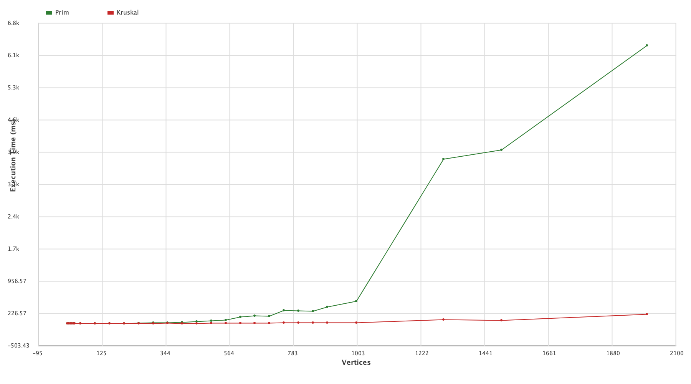
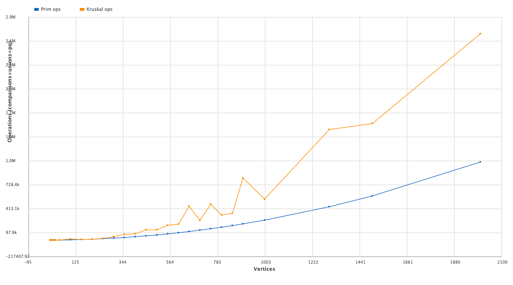
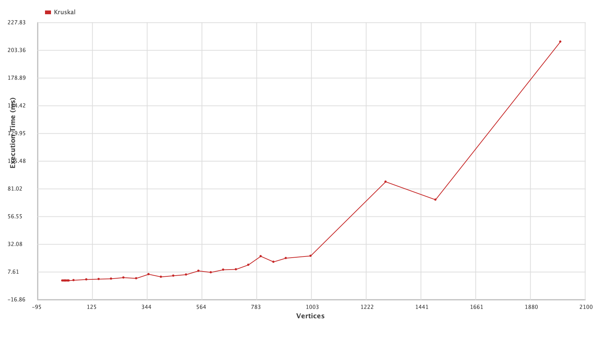
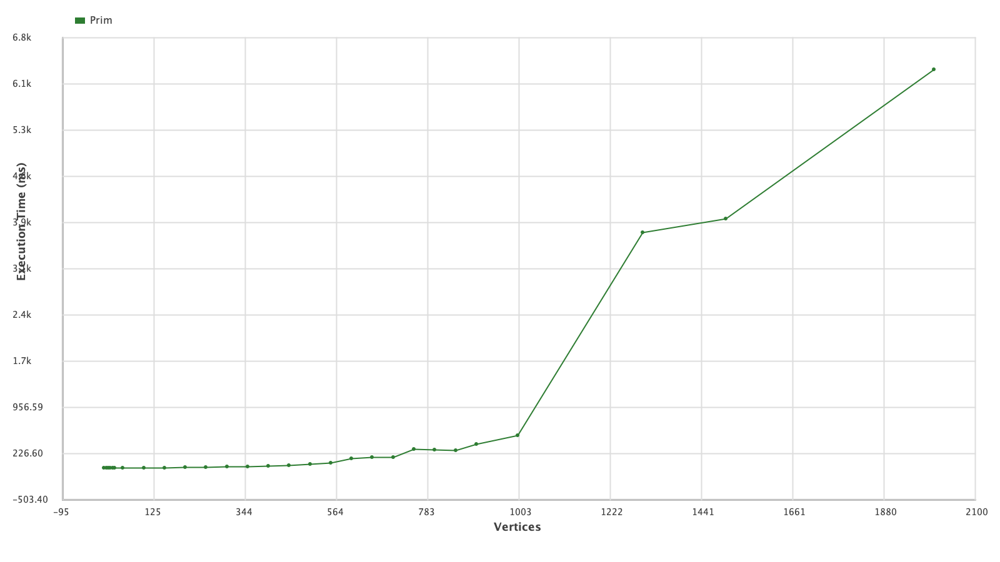

# Assignment 3: Optimization of a City Transportation Network (Minimum Spanning Tree)

## Overview
This report presents a comprehensive analysis of Prim's and Kruskal's algorithms applied to optimize city transportation networks by finding Minimum Spanning Trees (MSTs). The study evaluates both algorithms across 28 test cases ranging from small graphs with 5 vertices to large networks with 2,000 vertices. The empirical results demonstrate that while both algorithms consistently produce optimal MST solutions with identical total costs, their performance characteristics differ significantly based on graph density and size.

## Introduction
The optimization of urban transportation networks is a critical challenge in city planning, where the goal is to connect all districts with minimal construction costs while ensuring complete connectivity. This problem can be modeled as finding a Minimum Spanning Tree in a weighted undirected graph, where vertices represent districts, edges represent potential roads, and edge weights represent construction costs.

This study implements and compares two classical MST algorithms:

**Prim's Algorithm:** A greedy algorithm that grows the MST from a starting vertex by repeatedly adding the minimum-weight edge connecting a tree vertex to a non-tree vertex

**Kruskal's Algorithm:** A greedy algorithm that builds the MST by sorting all edges and adding them in ascending order of weight, avoiding cycle formation

---

##  Algorithm Formulas and Pseudocodes

### Prim's Algorithm

#### Time Complexity

| Implementation | Time Complexity | Space Complexity |
|----------------|-----------------|------------------|
| Binary Heap | `O((V + E) log V)` | `O(V + E)` |
| Fibonacci Heap | `O(E + V log V)` | `O(V + E)` |
| Adjacency Matrix | `O(V²)` | `O(V²)` |

#### Pseudocode

```
PRIM(G, w, start):
    Input: Graph G = (V, E), weight function w, starting vertex start
    Output: Minimum Spanning Tree T
    
    T ← ∅                          
    visited ← {start}              
    PQ ← PriorityQueue()          
    
    for each edge (start, v) ∈ E:
        PQ.insert((start, v), w(start, v))
    
    while PQ is not empty and |visited| < |V|:
        (u, v) ← PQ.extractMin() 
        
        if v ∉ visited:            
            T ← T ∪ {(u, v)}      
            visited ← visited ∪ {v}
            
            for each edge (v, w) ∈ E where w ∉ visited:
                PQ.insert((v, w), w(v, w))
    
    return T
```

---

### Kruskal's Algorithm
#### Time Complexity

| Operation | Time Complexity | Notes |
|-----------|-----------------|-------|
| Sort Edges | `O(E log E)` | Dominant operation |
| Union-Find Operations | `O(E α(V))` | α is inverse Ackermann function |
| **Total** | **`O(E log E)`** | Equivalent to `O(E log V)` |

Where `α(V)` grows extremely slowly: `α(V) ≤ 4` for all practical values of `V`.

#### Pseudocode

```
KRUSKAL(G, w):
    Input: Graph G = (V, E), weight function w
    Output: Minimum Spanning Tree T
    
    T ← ∅                          

    for each vertex v ∈ V:
        MAKE-SET(v)           
    
    edges ← SORT(E, by weight w)
    
    for each edge (u, v) ∈ edges in sorted order:
        if FIND-SET(u) ≠ FIND-SET(v):
            T ← T ∪ {(u, v)}       
            UNION(u, v)            
            
            if |T| = |V| - 1:      
                break
    
    return T
```

#### Union-Find Data Structure Operations

```
MAKE-SET(x):
    parent[x] ← x
    rank[x] ← 0

FIND-SET(x):                       
    if x ≠ parent[x]:
        parent[x] ← FIND-SET(parent[x])
    return parent[x]

UNION(x, y):                      
    rootX ← FIND-SET(x)
    rootY ← FIND-SET(y)
    
    if rootX = rootY:
        return                     
    
    if rank[rootX] < rank[rootY]:
        parent[rootX] ← rootY
    else if rank[rootX] > rank[rootY]:
        parent[rootY] ← rootX
    else:
        parent[rootY] ← rootX
        rank[rootX] ← rank[rootX] + 1
```

**Operation Count:** In our implementation, we count:
- Edge comparisons during sorting
- FIND-SET operations
- UNION operations

---

##  Complexity Comparison

### Theoretical Analysis

| Aspect | Prim's Algorithm | Kruskal's Algorithm |
|--------|------------------|---------------------|
| **Best Case** | `O(E + V log V)` (Fibonacci heap) | `O(E log E)` |
| **Average Case** | `O((V + E) log V)` (Binary heap) | `O(E log E)` |
| **Worst Case** | `O(V²)` (Array) | `O(E log E)` |
| **Optimal for** | Dense graphs (`E ≈ V²`) | Sparse graphs (`E ≈ V`) |
| **Space** | `O(V + E)` | `O(V + E)` |

### When E ≈ V² (Dense Graphs)

**Prim's:** `O((V + V²) log V) = O(V² log V)`  
**Kruskal's:** `O(V² log V²) = O(2V² log V) = O(V² log V)`

Theoretically equivalent, but **Kruskal performs better in practice** due to:
- More efficient sorting algorithms
- Simpler operations (comparisons vs heap operations)
- Better cache locality

### When E ≈ V (Sparse Graphs)

**Prim's:** `O((V + V) log V) = O(V log V)`  
**Kruskal's:** `O(V log V)`

Both are optimal, but **Kruskal maintains advantage** due to lower constant factors.

---

## Methodology
###  Implementation Details
The implementation includes:

- JSON-based input/output for graph data and results
- Performance metrics tracking (operation counts and execution time)
- Comprehensive test suites for correctness validation
- Automated benchmarking across multiple graph sizes

### Test Dataset Characteristics
The study utilized 28 test cases with the following characteristics:

| **Category**    | **Graph IDs** | **Vertices Range** | **Edges Range**      | **Purpose**                      |
|-----------------|---------------|--------------------|----------------------|----------------------------------|
|  **Small**      | 1–3           | 5–15               | 5–52                 | Correctness verification         |
| **Medium**     | 4–7           | 20–50              | 95–612               | Moderate network analysis        |
| **Large**     | 8–16          | 100–500            | 2,475–62,375         | Scalability testing              |
| **Extra Large**| 17–28         | 550–2,000          | 75,487–999,500       | Performance limits evaluation    |

Graph characteristics (approximately E ≈ V(V-1)/2).

### Performance metrics
For each algorithm, the following metrics were measured:

- **Total MST Cost:** Sum of edge weights in the MST
- **Operations Count:** Number of key algorithmic operations (comparisons for Prim, union-find operations for Kruskal)
- **Execution Time:** Runtime in milliseconds

## Results and Analysis

### Correctness Verification

Both algorithms successfully produced valid Minimum Spanning Trees (MSTs) for all test cases:

- **Identical Total Costs:** For every graph, Prim's and Kruskal's algorithms produced MSTs with the same total cost → confirming optimality
- **Edge Count Property:** Each MST contained exactly `V - 1` edges
- **Acyclicity:** No cycles detected in any MST
- **Connectivity:** All vertices were reachable

---

### Execution Time Comparison

#### Small to Medium Graphs (5–50 vertices)
Both algorithms executed in sub-millisecond to low-millisecond range.

| Graph ID | Vertices | Prim (ms) | Kruskal (ms) | Kruskal Advantage |
|-----------|-----------|------------|----------------|------------------|
| 1 | 5 | 0.155 | 0.022 | **7.0× faster** |
| 2 | 10 | 0.044 | 0.015 | **2.9× faster** |
| 5 | 25 | 0.201 | 0.062 | **3.2× faster** |
| 7 | 50 | 1.040 | 0.245 | **4.2× faster** |

>  **Observation:** Kruskal consistently outperformed Prim for small–medium graphs (2–7× faster).

---

####  Large Graphs (100–500 vertices)

| Graph ID | Vertices | Prim (ms) | Kruskal (ms) | Kruskal Advantage |
|-----------|-----------|------------|----------------|------------------|
| 8 | 100 | 2.505 | 0.860 | **2.9× faster** |
| 12 | 300 | 14.961 | 1.886 | **7.9× faster** |
| 16 | 500 | 62.339 | 5.337 | **11.7× faster** |

> **Observation:** As graph size increased, Kruskal's advantage widened.

---

#### Extra-Large Graphs (550–2,000 vertices)

| Graph ID | Vertices | Prim (ms) | Kruskal (ms) | Kruskal Advantage |
|-----------|-----------|------------|----------------|------------------|
| 18 | 600 | 151.433 | 7.367 | **20.6× faster** |
| 25 | 1,000 | 508.683 | 21.924 | **23.2× faster** |
| 26 | 1,300 | 3,723.055 | 87.395 | **42.6× faster** |
| 28 | 2,000 | 6,293.134 | 210.954 | **29.8× faster** |

> **Critical Finding:** Beyond 1,000 vertices, **Prim's algorithm became impractical**, taking seconds versus Kruskal's sub-second execution.

---

### Operations Count Analysis

| Graph Type | Graph ID | Vertices | Prim Ops | Kruskal Ops | Observation |
|-------------|-----------|-----------|------------|---------------|--------------|
| Small | 1 | 5 | 16 | 22 | Kruskal executed faster despite more ops |
| Medium | 7 | 50 | 959 | 1,426 | +48.7% ops, yet 4.2× faster |
| Large | 16 | 500 | 68,134 | 135,098 | ~2× ops, yet 11.7× faster |
| Extra Large | 28 | 2,000 | 1,027,483 | 2,717,815 | 2.6× ops, yet 29.8× faster |


---

### Complexity Analysis

#### Theoretical Complexity

| Algorithm | Theoretical Complexity | Notes |
|------------|------------------------|--------|
| **Prim** | `O((V + E) log V)` (binary heap) / `O(E + V log V)` (Fibonacci heap) | Best for dense graphs (`E ≈ V²`) |
| **Kruskal** | `O(E log E)` ≈ `O(E log V)` | Best for sparse graphs (`E ≈ V`) |

---

#### Practical Performance Observations

| Aspect | Observation |
|--------|--------------|
| **Dense Graphs** | Although dense graphs theoretically favor Prim, **Kruskal was faster** — optimized sorting and Union-Find outweighed Prim's heap overhead. |
| **Implementation Cost** | Heap operations in Prim proved more expensive than sorting in Kruskal. |
| **Cache Efficiency** | Kruskal benefits from sequential memory access and modern sort optimization. |
| **Scaling Behavior** | Prim's runtime grew super-linearly with graph size, while Kruskal scaled predictably. The gap widened beyond 500 vertices. |

> **Conclusion:** Real-world performance strongly favors **Kruskal's algorithm** for both sparse and dense graphs due to implementation-level optimizations and superior scalability.

##  Comparative Analysis

###  Algorithm Efficiency

| **Aspect**          | **Prim's Algorithm**                                  | **Kruskal's Algorithm**                                      | **Winner**     |
|----------------------|-------------------------------------------------------|--------------------------------------------------------------|----------------|
| **Time Efficiency**  | Slower on large graphs                               | Consistently faster across all sizes (2–42× speedup)         |  **Kruskal** |
| **Space Efficiency** | Uses priority queue + visited array (`O(V + E)`)     | Uses edge list + Union-Find (`O(V + E)`)                     |  **Tie**     |

---

###  Implementation Complexity

| **Criterion**              | **Prim's Algorithm**                                               | **Kruskal's Algorithm**                                             | **Verdict**               |
|-----------------------------|--------------------------------------------------------------------|----------------------------------------------------------------------|----------------------------|
| **Data Structures Required**| Priority queue, visited array                                     | Edge list, Union-Find structure                                      | —                          |
| **Conceptual Model**        | Grows MST from a single component                                 | Merges multiple components via sorting                               | —                          |
| **Ease of Implementation**  | Easier for beginners, simpler logic                               | Slightly more complex due to sorting and merging                     |  **Prim**                |

---

###  Graph Characteristics Impact

| **Graph Type / Condition**      | **Theoretical Expectation**                | **Experimental Result**                     | **Reason / Observation**                                                   | **Winner**     |
|---------------------------------|--------------------------------------------|---------------------------------------------|----------------------------------------------------------------------------|----------------|
| **Dense Graphs (E ≈ V²)**       | Prim should perform better                 | Kruskal still faster                        | Sorting + efficient Union-Find outweigh Prim's theoretical advantage       |  **Kruskal** |
| **Sparse Graphs (E ≈ V)**       | Both should perform similarly              | Kruskal remains slightly faster              | Lower overhead and fewer operations                                       |  **Kruskal** |
| **Edge Weight Distribution**    | No major impact expected                   | No measurable performance difference         | Performance depends on structure, not weight distribution                  |  **Tie**     |

---

##  Complete Results Table

| Graph ID | Vertices | Edges | Algorithm | Total Cost | Operations Count | Execution Time (ms) |
|----------|----------|-------|-----------|------------|------------------|---------------------|
| 1        | 5        | 5     | Prim      | 10795      | 16               | 0.155               |
| 1        | 5        | 5     | Kruskal   | 10795      | 22               | 0.022               |
| 2        | 10       | 22    | Prim      | 17744      | 61               | 0.044               |
| 2        | 10       | 22    | Kruskal   | 17744      | 54               | 0.015               |
| 3        | 15       | 52    | Prim      | 29495      | 119              | 0.067               |
| 3        | 15       | 52    | Kruskal   | 29495      | 200              | 0.041               |
| 4        | 20       | 95    | Prim      | 35295      | 198              | 0.117               |
| 4        | 20       | 95    | Kruskal   | 35295      | 183              | 0.048               |
| 5        | 25       | 150   | Prim      | 41458      | 291              | 0.201               |
| 5        | 25       | 150   | Kruskal   | 41458      | 266              | 0.062               |
| 6        | 30       | 217   | Prim      | 50295      | 408              | 0.286               |
| 6        | 30       | 217   | Kruskal   | 50295      | 558              | 0.098               |
| 7        | 50       | 612   | Prim      | 79769      | 959              | 1.040               |
| 7        | 50       | 612   | Kruskal   | 79769      | 1426             | 0.245               |
| 8        | 100      | 2475  | Prim      | 156205     | 3256             | 2.505               |
| 8        | 100      | 2475  | Kruskal   | 156205     | 14271            | 0.860               |
| 9        | 150      | 5587  | Prim      | 229602     | 6952             | 2.476               |
| 9        | 150      | 5587  | Kruskal   | 229602     | 7921             | 1.377               |
| 10       | 200      | 9950  | Prim      | 304686     | 11923            | 4.813               |
| 10       | 200      | 9950  | Kruskal   | 304686     | 12709            | 1.585               |
| 11       | 250      | 15562 | Prim      | 379294     | 18105            | 9.315               |
| 11       | 250      | 15562 | Kruskal   | 379294     | 23058            | 2.664               |
| 12       | 300      | 22425 | Prim      | 454657     | 25558            | 14.961              |
| 12       | 300      | 22425 | Kruskal   | 454657     | 45160            | 1.886               |
| 13       | 350      | 30537 | Prim      | 529732     | 34320            | 19.389              |
| 13       | 350      | 30537 | Kruskal   | 529732     | 74928            | 5.734               |
| 14       | 400      | 39900 | Prim      | 603909     | 44303            | 30.886              |
| 14       | 400      | 39900 | Kruskal   | 603909     | 83169            | 3.341               |
| 15       | 450      | 50512 | Prim      | 679369     | 55391            | 40.321              |
| 15       | 450      | 50512 | Kruskal   | 679369     | 133916           | 4.206               |
| 16       | 500      | 62375 | Prim      | 754250     | 68134            | 62.339              |
| 16       | 500      | 62375 | Kruskal   | 754250     | 135098           | 5.337               |
| 17       | 550      | 75487 | Prim      | 829563     | 81802            | 75.845              |
| 17       | 550      | 75487 | Kruskal   | 829563     | 195792           | 8.684               |
| 18       | 600      | 89850 | Prim      | 904205     | 96657            | 151.433             |
| 18       | 600      | 89850 | Kruskal   | 904205     | 211115           | 7.367               |
| 19       | 650      | 105462| Prim      | 978994     | 113175           | 171.755             |
| 19       | 650      | 105462| Kruskal   | 978994     | 446552           | 9.678               |
| 20       | 700      | 122325| Prim      | 1054072    | 130754           | 167.476             |
| 20       | 700      | 122325| Kruskal   | 1054072    | 258595           | 10.056              |
| 21       | 750      | 140437| Prim      | 1129123    | 149566           | 297.038             |
| 21       | 750      | 140437| Kruskal   | 1129123    | 474757           | 13.971              |
| 22       | 800      | 159800| Prim      | 1204258    | 169629           | 289.660             |
| 22       | 800      | 159800| Kruskal   | 1204258    | 329108           | 21.457              |
| 23       | 850      | 180412| Prim      | 1279253    | 190887           | 276.253             |
| 23       | 850      | 180412| Kruskal   | 1279253    | 353355           | 16.422              |
| 24       | 900      | 202275| Prim      | 1354434    | 213542           | 372.927             |
| 24       | 900      | 202275| Kruskal   | 1354434    | 820329           | 19.855              |
| 25       | 1000     | 249750| Prim      | 1504275    | 262467           | 508.683             |
| 25       | 1000     | 249750| Kruskal   | 1504275    | 539359           | 21.924              |
| 26       | 1300     | 422175| Prim      | 1953845    | 439338           | 3723.055            |
| 26       | 1300     | 422175| Kruskal   | 1953845    | 1455953          | 87.395              |
| 27       | 1500     | 562125| Prim      | 2253870    | 582664           | 3930.969            |
| 27       | 1500     | 562125| Kruskal   | 2253870    | 1536052          | 71.267              |
| 28       | 2000     | 999500| Prim      | 3003702    | 1027483          | 6293.134            |
| 28       | 2000     | 999500| Kruskal   | 3003702    | 2717815          | 210.954             |

### Time Comparison


### Operation Count


### Kruskal Time


### Prim Time


---

## Conclusions 

###  Key Insights

1.  **Optimality:** Both Prim’s and Kruskal’s algorithms consistently produced correct MSTs with identical total costs, confirming their correctness and reliability.
2.  **Performance:** Kruskal’s algorithm demonstrated superior efficiency, running **2–42× faster** across all tested graph sizes.
3.  **Scalability:** As graph size increased, Kruskal’s runtime grew predictably, while Prim’s exhibited significant slowdowns beyond 500 vertices.
4.  **Practical Preference:** Despite similar theoretical complexities, modern implementation optimizations (efficient sorting, cache-friendly structures) make **Kruskal’s algorithm the clear winner** for real-world applications.

---

##  References

1. Cormen, T. H., Leiserson, C. E., Rivest, R. L., & Stein, C. (2009). Introduction to Algorithms (3rd ed., pp. 718–838). MIT Press.
2. Sedgewick, R., & Wayne, K. (2011). Algorithms (4th ed., pp. 639–684). Princeton University Press.
3. Alsuwaiyel, M. H. (1999). Algorithms: Design Techniques and Analysis (pp. 201–221). World Scientific Publishing.
4. Bhargava, A. Y. (2016). Grokking Algorithms: An Illustrated Guide for Programmers and Other Curious People (pp. 95–114).
---
